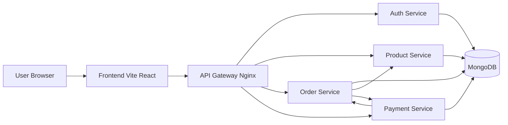

# E-Commerce Microservices Platform

Production-style e-commerce system built with Node.js microservices, API gateway routing, JWT security, Docker orchestration, CI/CD, and DevSecOps scanning.

- Project overview and architecture
- Microservice responsibilities and API design
- Technology stack
- Security approach (JWT, protected routes, internal service key)
- Inter-service communication design
- Docker setup and execution steps
- CI/CD and DevSecOps workflow summary
- Testing strategy and commands
- API documentation locations (Swagger)
- Deployment guidance (Render/Railway)
- Troubleshooting notes

---

## 1) Project Overview

This project implements a complete e-commerce platform using a microservices architecture.

Core business domains are separated into independent services:

- Auth Service: registration, login, profile, JWT issuing
- Product Service: product catalog CRUD and filtering
- Order Service: order lifecycle and orchestration
- Payment Service: payment processing, gateway callback handling, notifications
- API Gateway: single entry point and route forwarding
- Frontend: React application for customer/admin workflows

The solution demonstrates:

- Service decomposition and independent responsibilities
- Secure API access using JWT
- Service-to-service communication for business workflow completion
- Containerized deployment with Docker Compose
- Automated quality checks via GitHub Actions

---

## 2) High-Level Architecture



---

## 3) Microservices and Responsibilities

### Auth Service (Port 5001)

- User registration and login
- JWT generation and token-based access control
- Authenticated profile retrieval

### Product Service (Port 5002)

- Product creation, retrieval, update, deletion
- Category/price/search filtering
- Admin-protected write operations

### Order Service (Port 5003)

- Order creation and status management
- User/admin order retrieval
- Internal payment-status update endpoint
- Calls Product Service (validation) and Payment Service (payment + notification)

### Payment Service (Port 5004)

- Payment initialization and processing
- Callback notification endpoint for payment gateway
- Payment details retrieval
- Notification creation and retrieval

### API Gateway (Port 80)

- Centralized route forwarding
- Public entry point for frontend and API consumers

---

## 4) API Gateway Route Map

| Gateway Prefix     | Target Service  |
| ------------------ | --------------- |
| /api/auth          | Auth Service    |
| /api/products      | Product Service |
| /api/orders        | Order Service   |
| /api/payments      | Payment Service |
| /api/notifications | Payment Service |

---

## 5) Key API Endpoints

### Auth

- POST /api/auth/register
- POST /api/auth/login
- GET /api/auth/profile

### Product

- POST /api/products (admin)
- GET /api/products
- GET /api/products/:id
- PUT /api/products/:id (admin)
- DELETE /api/products/:id (admin)

### Order

- POST /api/orders
- GET /api/orders
- GET /api/orders/:id
- GET /api/orders/user/:userId
- PUT /api/orders/:id (admin)
- DELETE /api/orders/:id
- POST /api/orders/internal/payment-status (internal)

### Payment / Notification

- POST /api/payments/process
- POST /api/payments/notify
- GET /api/payments/:paymentId
- POST /api/notifications/send
- GET /api/notifications

---

## 6) Technology Stack

| Layer            | Technology                                  |
| ---------------- | ------------------------------------------- |
| Frontend         | React, Vite, Axios                          |
| API Services     | Node.js, Express                            |
| Database         | MongoDB, Mongoose                           |
| Auth             | JWT                                         |
| API Docs         | Swagger (swagger-jsdoc, swagger-ui-express) |
| Testing          | Jest, Supertest                             |
| Containerization | Docker, Docker Compose                      |
| CI/CD            | GitHub Actions                              |
| DevSecOps        | CodeQL, npm audit, Trivy                    |

---

## 7) Project Structure

```text
ecommerce-microservices/
├── api-gateway/
├── auth-service/
├── product-service/
├── order-service/
├── payment-service/
├── frontend/
├── .github/workflows/
│   ├── main.yml
│   └── security.yml
└── docker-compose.yml
```

Each backend service follows a layered structure:

- src/controllers
- src/models
- src/routes
- src/services (where applicable)
- src/middlewares
- src/config
- test and tests

---

## 8) Security Implementation

### JWT Authentication

- JWT issued at login/register in Auth Service
- Protected routes validate token through middleware
- Role checks enforce admin-only operations

### Input Validation

- express-validator used on critical Order endpoints
- Request payload validation and clear error responses

### Internal Service Protection

- Internal callback endpoint uses INTERNAL_SERVICE_KEY header validation
- Prevents unauthorized external status updates

---

## 9) Inter-Service Communication

Inter-service communication is implemented using HTTP calls (Axios):

- Order Service -> Product Service: validate item and stock
- Order Service -> Payment Service: initialize/process payment
- Order Service -> Payment Service: trigger notification
- Payment Service -> Order Service: update payment status after callback

---

## 10) Local Setup

### Prerequisites

- Node.js 18+ or 20+
- npm
- Docker Desktop

### Clone and Install

```bash
git clone <your-repo-url>
cd ecommerce-microservices
```

Install dependencies (if running services outside Docker):

```bash
cd auth-service && npm install
cd ../product-service && npm install
cd ../order-service && npm install
cd ../payment-service && npm install
cd ../frontend && npm install
```

---

## 11) Environment Variables

Main variables used across services:

- JWT_SECRET
- MONGODB_URI
- PRODUCT_SERVICE_URL
- PAYMENT_SERVICE_URL
- ORDER_SERVICE_URL
- INTERNAL_SERVICE_KEY
- PAYHERE_MERCHANT_ID
- PAYHERE_MERCHANT_SECRET
- PAYHERE_NOTIFY_URL

Use each service's .env.example as the baseline where available.

---

## 12) Run with Docker Compose

From project root:

```bash
docker compose up --build
```

Expected service ports:

- Gateway: 80
- Auth: 5001
- Product: 5002
- Order: 5003
- Payment: 5004
- MongoDB: 27017

---

## 13) API Documentation (Swagger)

Swagger UI endpoints:

- Auth: http://localhost:5001/api-docs
- Product: http://localhost:5002/api-docs
- Order: http://localhost:5003/api-docs
- Payment: http://localhost:5004/api-docs

Gateway-based access may also be available depending on nginx route configuration.

---

## 14) Testing

Backend services use Jest + Supertest.

Run per service:

```bash
cd auth-service && npm test
cd ../product-service && npm test
cd ../order-service && npm test
cd ../payment-service && npm test
```

Frontend build check:

```bash
cd frontend && npm run build
```

---

## 15) CI/CD and DevSecOps

GitHub workflows included:

- .github/workflows/main.yml
  - Install dependencies
  - Run tests
  - Build frontend
  - Build Docker images

- .github/workflows/security.yml
  - CodeQL analysis
  - npm audit checks
  - Trivy filesystem scan

---

## 16) Deployment

Recommended platforms:

- Render
- Railway

Deployment approach:

1. Connect GitHub repository
2. Configure service-specific environment variables
3. Deploy each service (or container stack)
4. Configure public URLs and gateway integration

Deployment URLs:

- Frontend URL: add your deployed URL here
- API Gateway URL: add your deployed URL here

---

## 17) Common Issues and Fixes

- docker compose up fails
  - Check Docker Desktop is running
  - Run docker compose down --remove-orphans
  - Retry docker compose up --build

- Unauthorized API responses
  - Ensure JWT token is included in Authorization header
  - Ensure all services share the same JWT_SECRET

- Payment callback not updating order
  - Verify ORDER_SERVICE_URL and INTERNAL_SERVICE_KEY in payment service

---

## 18) Final Status Summary

This project currently provides:

- Proper microservice separation
- Inter-service communication
- JWT-based security and role protection
- Dockerized services
- CI/CD and security workflows
- Swagger API documentation
- Automated tests in each backend service

This meets the expected Node.js microservice scenario requirements for architecture, security, testing, DevOps, and documentation.
